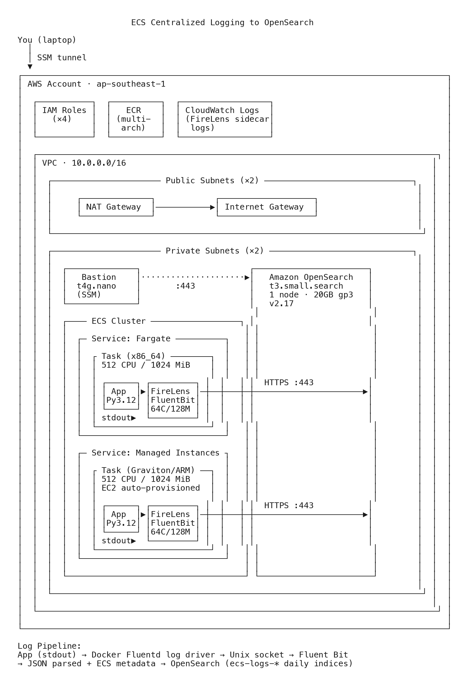

# Demo: ECS Centralized Logging to OpenSearch

Demonstrates centralized logging from ECS tasks to a VPC-based Amazon OpenSearch provisioned cluster using FireLens (Fluent Bit). Supports both Fargate and ECS Managed Instances (Graviton/ARM) with multi-architecture container images.

## Architecture



## Components

| Resource | Details |
|---|---|
| VPC | 10.0.0.0/16, 2 public + 2 private subnets, NAT, IGW |
| ECS Cluster | Fargate + Managed Instances capacity providers |
| ECS Service (Fargate) | 512 CPU / 1024 MiB, x86_64, app + FireLens sidecar |
| ECS Service (Managed Instances) | Same task def, Graviton/ARM, auto-provisioned EC2 |
| OpenSearch | t3.small.search, single node, VPC-based, 20GB gp3 |
| Bastion | t4g.nano, SSM-enabled, private subnet |
| ECR | Multi-arch image (linux/amd64 + linux/arm64) |
| IAM | Task role, execution role, infrastructure role, bastion role |
| CloudWatch Logs | FireLens sidecar logs (troubleshooting) |

## Log Pipeline

The app emits structured JSON to stdout. The ECS agent configures the Fluentd Docker log driver to pipe container stdout/stderr to the FireLens sidecar (Fluent Bit v2.34.3, pinned to stable) over a Unix socket. Fluent Bit parses the JSON into top-level fields using the built-in `parse-json.conf`, injects ECS metadata, and forwards to OpenSearch.

```
App (stdout) → Docker fluentd log driver → Unix socket → Fluent Bit → JSON parsed → ECS metadata added → OpenSearch
```

Fields in OpenSearch: `level`, `status`, `endpoint`, `method`, `duration_ms`, `request_id`, `message`, plus ECS metadata (`ecs_cluster`, `ecs_task_arn`, `ecs_task_definition`, `container_name`).

Resource limits: Fluent Bit sidecar is capped at 64 CPU / 128 MiB to prevent it from impacting app performance. The app container gets the remaining task resources (up to 448 CPU / 896 MiB).

## Prerequisites

- AWS CLI configured with valid credentials
- Terraform >= 1.5
- Docker with buildx support (Colima or Docker Desktop)

## Deploy

### 1. Clone and configure

```bash
git clone <repo-url>
cd demo-ecs-opensearch-logging
cp terraform.tfvars.example terraform.tfvars
```

Edit `terraform.tfvars`:
- `region` — AWS region to deploy in (default: `ap-southeast-1`)
- `app_image` — leave as-is, `deploy.sh` will update it automatically
- `create_opensearch_service_linked_role` — set to `false` if the OpenSearch service-linked role already exists in your account

### 2. Set up Docker buildx (first time only)

The app image is built for both x86 and ARM (Graviton). This requires a multi-platform Docker builder:

```bash
docker buildx create --name multiarch --driver docker-container --use
```

### 3. Build and push the container image

```bash
./deploy.sh
```

This script will:
1. Run `terraform init`
2. Create the ECR repository
3. Build and push a multi-arch Docker image (linux/amd64 + linux/arm64)
4. Update `app_image` in `terraform.tfvars` with the ECR image URI

### 4. Deploy the infrastructure

```bash
terraform apply    # ~10-15 min (OpenSearch takes the longest)
```

### 5. Access OpenSearch Dashboards

OpenSearch is in a private subnet. Use SSM port forwarding through the bastion:

```bash
# Terminal 1: Start the tunnel
terraform output -raw ssm_tunnel_command | bash

# Terminal 2: Open Dashboards
open https://localhost:8443/_dashboards
```

Note: Browser will show a certificate warning — proceed past it.

1. Go to **Stack Management** → **Index Patterns** → Create `ecs-logs*`
2. Select `@timestamp` as the time field
3. Go to **Discover** to see logs flowing in
4. Build visualizations: error rates, response time distributions, endpoint traffic

### (Optional) Apply ISM policy for index lifecycle

In OpenSearch Dashboards **Dev Tools**, paste:

```json
PUT _plugins/_ism/policies/ecs-logs-policy
{
  "policy": {
    "policy_id": "ecs-logs-policy",
    "description": "Delete ECS log indices older than 7 days",
    "default_state": "hot",
    "states": [
      {
        "name": "hot",
        "actions": [],
        "transitions": [{ "state_name": "delete", "conditions": { "min_index_age": "7d" } }]
      },
      {
        "name": "delete",
        "actions": [{ "delete": {} }]
      }
    ],
    "ism_template": [{ "index_patterns": ["ecs-logs-*"] }]
  }
}
```

### Verify task architecture

```bash
aws ecs describe-tasks \
  --cluster demo-ecs-opensearch-logging \
  --tasks $(aws ecs list-tasks --cluster demo-ecs-opensearch-logging --query 'taskArns' --output text) \
  --query 'tasks[*].{launchType:launchType,arch:attributes[?name==`ecs.cpu-architecture`].value|[0]}' \
  --region ap-southeast-1
```

## Teardown

```bash
./destroy.sh
```

## Cost

- OpenSearch `t3.small.search`: ~$1.50/day
- NAT Gateway: ~$1.10/day
- ECS Fargate (512 CPU / 1024 MiB): ~$0.50/day
- ECS Managed Instance (Graviton): ~$0.50-1.00/day (varies by instance selected)
- Bastion (t4g.nano): ~$0.13/day
- **Total: ~$4-5/day** — tear down when done

## Files

```
demo-ecs-opensearch-logging/
├── main.tf, variables.tf, outputs.tf
├── terraform.tfvars.example    # copy to terraform.tfvars and fill in values
├── vpc.tf                  # VPC, subnets, NAT, IGW, security groups
├── ecs.tf                  # cluster, ECR, task definition, Fargate service
├── opensearch.tf           # OpenSearch domain (VPC-based), service-linked role
├── iam.tf                  # task/execution roles, CloudWatch log group
├── bastion.tf              # SSM bastion for Dashboards access
├── managed-instances.tf    # MI capacity provider, IAM, Graviton service
├── deploy.sh, destroy.sh   # automation scripts
├── diagrams/               # architecture diagram
└── app/
    ├── main.py             # structured JSON log generator
    └── Dockerfile          # python:3.12-alpine
```

## References

- [Centralized Amazon ECS task logging with Amazon OpenSearch](https://aws.amazon.com/blogs/containers/centralized-amazon-ecs-task-logging-with-amazon-opensearch/) — the blog post this demo is based on
- [FireLens for Amazon ECS](https://docs.aws.amazon.com/AmazonECS/latest/developerguide/using_firelens.html) — ECS log routing with FireLens
- [Under the Hood: FireLens for Amazon ECS Tasks](https://aws.amazon.com/blogs/containers/under-the-hood-firelens-for-amazon-ecs-tasks/) — how FireLens captures logs via the Fluentd Docker log driver and Unix socket
- [FireLens example: Parsing JSON logs](https://github.com/aws-samples/amazon-ecs-firelens-examples/blob/mainline/examples/fluent-bit/parse-json/README.md) — built-in JSON parser config in aws-for-fluent-bit
- [FireLens examples repository](https://github.com/aws-samples/amazon-ecs-firelens-examples) — sample logging architectures for FireLens
- [Fluent Bit OpenSearch output plugin](https://docs.fluentbit.io/manual/pipeline/outputs/opensearch) — Fluent Bit to OpenSearch configuration
- [AWS for Fluent Bit](https://github.com/aws/aws-for-fluent-bit) — source repo, versioning guidance, troubleshooting, and built-in configs
- [Amazon ECS Managed Instances](https://docs.aws.amazon.com/AmazonECS/latest/developerguide/ManagedInstances.html) — fully managed EC2 compute for ECS
- [Amazon ECS clusters](https://docs.aws.amazon.com/AmazonECS/latest/developerguide/clusters.html) — cluster types and capacity providers
- [Amazon ECS infrastructure IAM role](https://docs.aws.amazon.com/AmazonECS/latest/developerguide/infrastructure_IAM_role.html) — IAM role for Managed Instances
- [Pushing multi-architecture images to ECR](https://docs.aws.amazon.com/AmazonECR/latest/userguide/docker-push-multi-architecture-image.html) — multi-arch container images
- [OpenSearch ISM policies](https://docs.opensearch.org/docs/latest/im-plugin/ism/index/) — index lifecycle management
- [SSM Session Manager port forwarding](https://docs.aws.amazon.com/systems-manager/latest/userguide/session-manager-working-with-sessions-start.html) — remote host port forwarding
